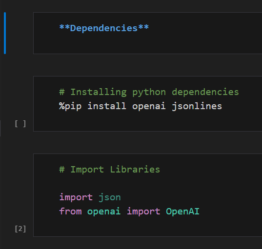
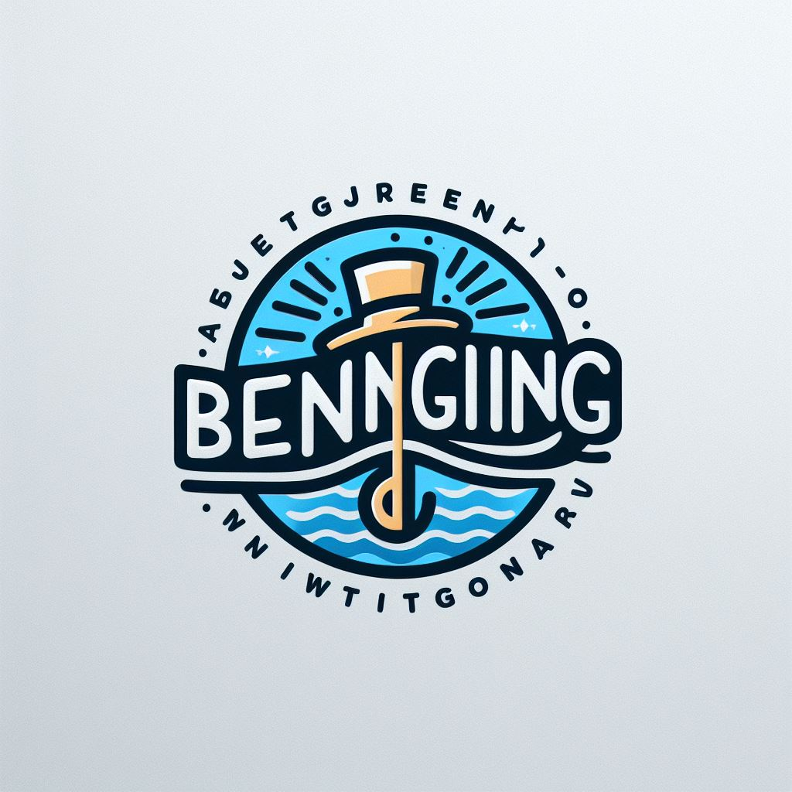

# Hackathon-AI-HACK-10

- - -

## Table of Contents

1. [Project Disclaimer](#project-disclaimer)
   - [Acknowledgment of External Resources](#acknowledgment-of-external-resources)
2. [Introduction](#introduction)
   - [How Our AI Works](#how-our-ai-works)
3. [Instruction](#instruction)
4. [Beninging: Embracing the Whimsy of Words](#beninging-embracing-the-whimsy-of-words)
5. [About Our Contributor](#about-our-contributor)
6. [QnA](#qna)

- - -

- - -

# Project Disclaimer

## Acknowledgment of External Resources

We express gratitude to contributors and authors of online resources pivotal in our project's development. The success of this project is indebted to the information, guidance, and assistance derived from these sources.

# Introduction

Our project addresses challenges in conventional websites, aiming to enhance user experience. Collaboration and insights from various AI applications have been instrumental in its realization.

Learn more about our design in the [wireframe document](.media/Bertravelling%20AI.pdf).

### How our AI Works

Our AI, trained on global travel datasets, processes information from online platforms and other AI systems. This collaborative approach ensures adaptability and proficiency.

# Instruction

1. Run both functions to set up the project.

# Beninging: Embracing the Whimsy of Words

Welcome to the world of **Beninging**—where "beginning" takes a playful detour into linguistic wonder. It captures the whimsical spirit of wordplay, turning typos into a dance of vowels and consonants.

Join the journey and embrace the magic of Beninging, where language itself becomes a canvas for playful expression.

# About Our Contributor
 
Jack

I'm CHONG KELVIN one of the contributor of Beninging. Feel free to visit my [GitHub Profile](https://github.com/kelocker), where I host various open-source projects and contributions.

I'm Chua Kian Ho, one of the contributor of Beninging. Free free to visit my [Github Profile](https://github.com/kelocker), this will be where I host most of my open-source projects and contributions.

# QnA